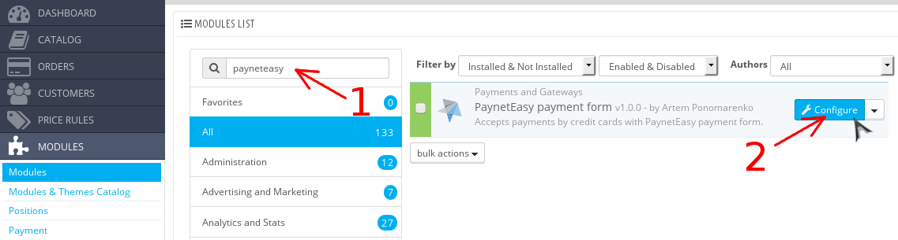
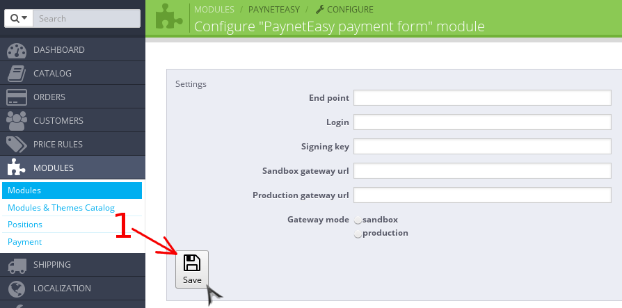

# Настройка модуля

1. Перейдите в панель администрирования Prestashop
2. Перейдите к списку модулей Prestashop (стрелка #1)

    
3. Откройте страницу с настройками модуля
    1. Введите запрос "payneteasy" в строку поиска модулей (стрелка #1)
    2. Перейдите на страницу с настройками модуля нажав кнопку "Configure" (стрелка #2)

    

4. Заполните настройки модуля и сохраните настройки (стрелка #1)

    