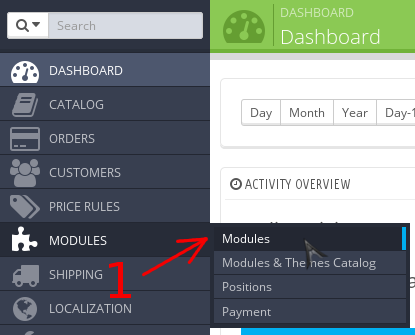

# Удаление модуля

1. Перейдите в панель администрирования Prestashop
2. Перейдите к списку модулей Prestashop (стрелка #1)

    
3. Удалите модуль
    1. Введите запрос "payneteasy" в строку поиска модулей (стрелка #1)
    2. Раскройте список действий для модуля (стрелка #2)
    2. Удалите модуль (стрелка #3)

    
