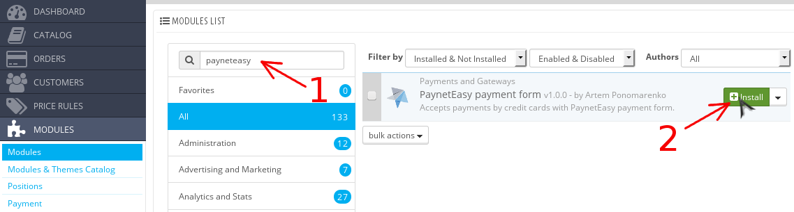

# Install Module

1. [Download package containing module](00-introduction.md#get_package)
2. Unpack the package into Prestashop root directory
3. Open Administration Panel of Prestashop
4. Go to list of modules (see arrow #1)

    
4. Install Module
    1. Enter "payneteasy" in the search box (see arrow #1)
    2. Install Module by pressing the "Install" button  (see arrow #2)

    

5. Confirm your intention to install the module, which is not related to verified modules (see arrow #1)

    
