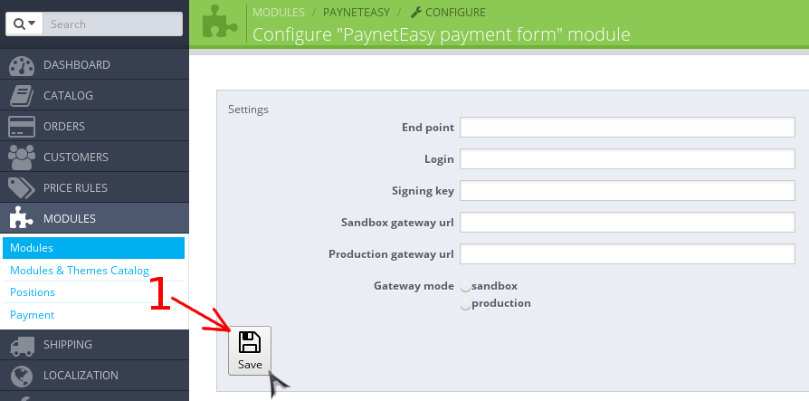

# Configure Module

1. Open Prestashop Administration Panel
2. Go to list of modules (see arrow #1)

    
3. Open the module settings page
    1. Enter "payneteasy" in the search box (see arrow #1)
    2. Open module setting page by pressing "Configure" button (see arrow #2)

    

4. Fill in the required settings of module and save them (arrow #1)

    