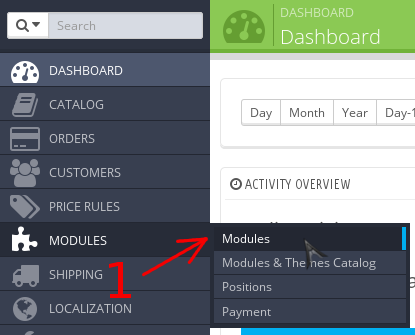
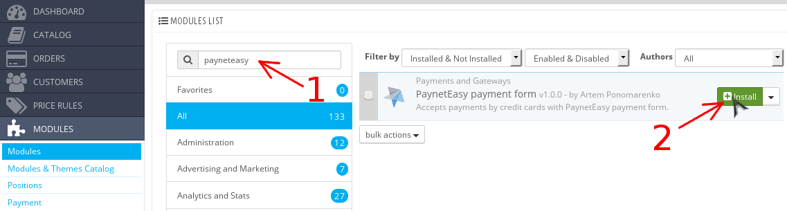
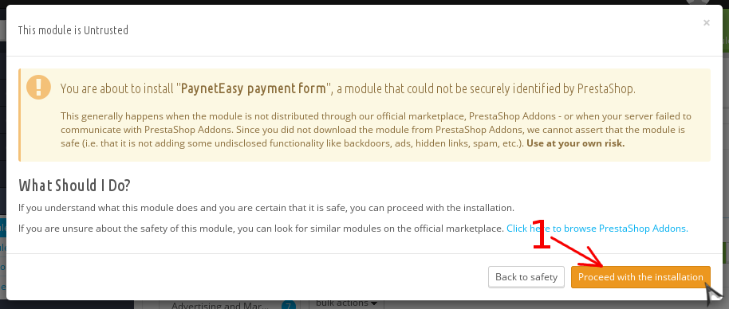

# Установка модуля

1. [Получите пакет с модулем ](00-introduction.md#get_package)
2. Распакуйте пакет в корневую папку Prestashop
3. Перейдите в панель администрирования Prestashop
4. Перейдите к списку модулей Prestashop (стрелка #1)

    
4. Установите модуль
    1. Введите запрос "payneteasy" в строку поиска модулей (стрелка #1)
    2. Установите модуль, нажав на кнопку "Install" (стрелка #2)

    

5. Подтвердите установку модуля, который не относится к проверенным (стрелка #1)

    
